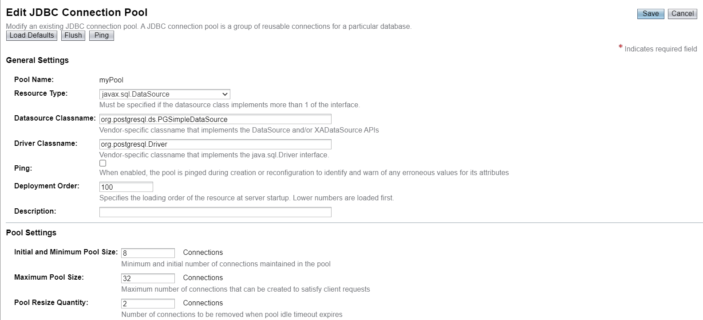
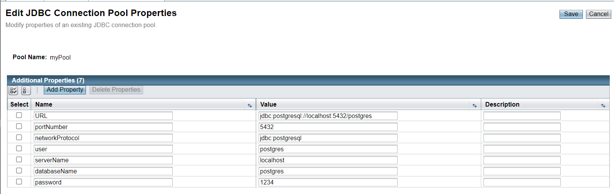
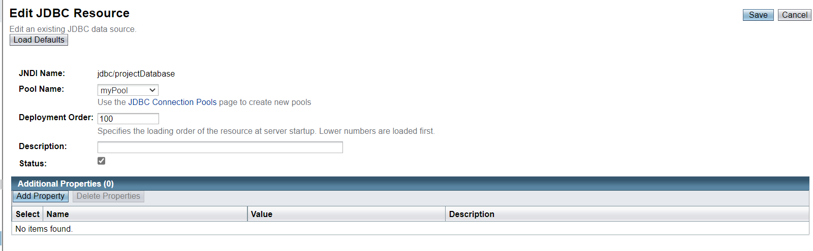
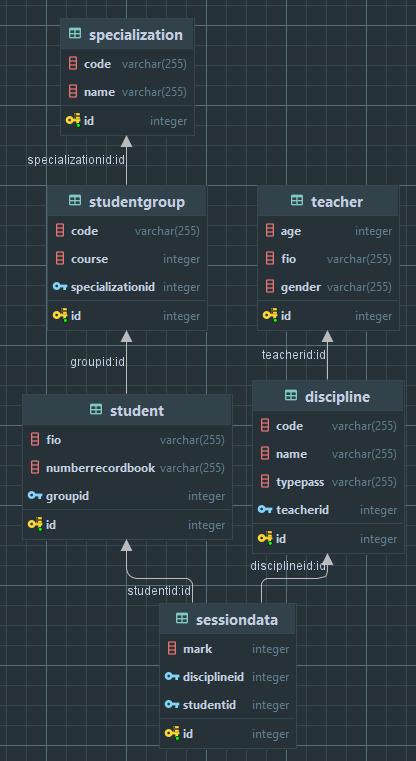
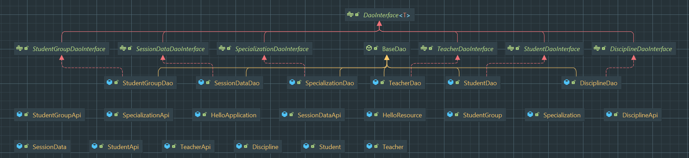
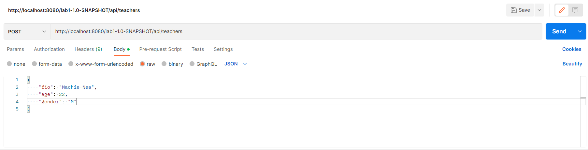
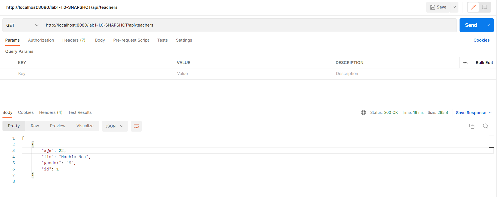
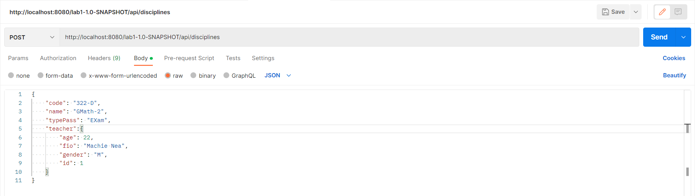
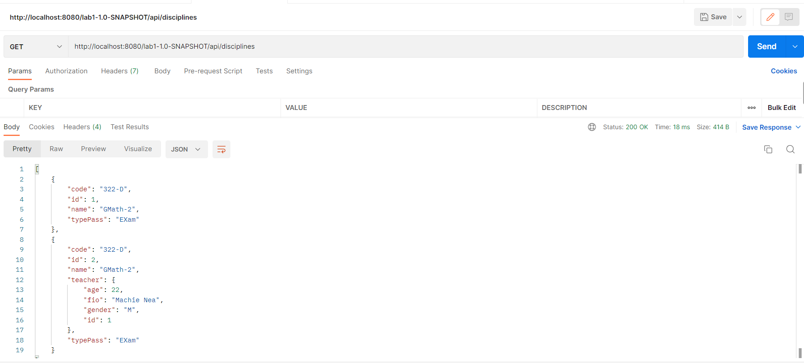

# Lab 1. App with JavaEE architecture/technologies
#### 6133 Gribanov Danil.
## Task 1
Download glassfish with version 5. Put into the root of the filesystem.
Start server with:
```
asadmin start-domain 
```
In folder: `glassfish5/glassfish/bin`

Before start, put JDBC driver of the PostgreSQL into glassfish lib folder 
(drop it into `glassfish5/glassfish/lib` folder).

## Setup pool connection





## Create resource



After all this, server can be launched.

# Task 2
Start database server with:
```
docker docker-compose.yml -d up --build
```

PostgreSQL server docker will start and adminer on port 8081 will also launch for database-moderation.

# Task 3



## Tables description
<table>
    <thead>
        <td>Table</td>
        <td>Description</td>
    </thead>
    <tr>
        <td>Student</td>
        <td>Student in the University</td>
    </tr>
    <tr>
        <td>Teacher</td>
        <td>Teacher in the University</td>
    </tr>
    <tr>
        <td>StudentGroup</td>
        <td>Group of students in the University</td>
    </tr>
    <tr>
        <td>Discipline</td>
        <td>Discipline in the University</td>
    </tr>
    <tr>
        <td>Session data</td>
        <td>Data about session for student by certain discipline</td>
    </tr>
    <tr>
        <td>Specialization</td>
        <td>Specialization of the group in the University</td>
    </tr>
</table>

# Task 4
For each table (class) were created own Java Bean using Loombok Library to remove boilerplate code. 
Each class has NamedQuires annotation which defined some queries for accessing the database. 
NamedQuires are more flexible and easy to use, compare to non-sql methods, and its not clear how JPA's will behave with
different relations. So, NamedQuires is the way.

# Task 5
We implemented the Data Access Object pattern to provide access to the database. The following scheme depicts our
application backend.



# Task 6
As a view layer, has been implemented several web servlets which provide REST API for tables.
In the servlets, dao objects are injected using dependency injection annotation (@EJB)

### Examples from postman:

We will create user:



Check it:



Create discipline and discipline with attached teacher. 
Example with POST to create discipline with attached teacher:



Check it:



End.

