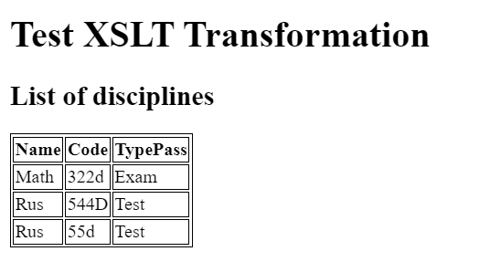
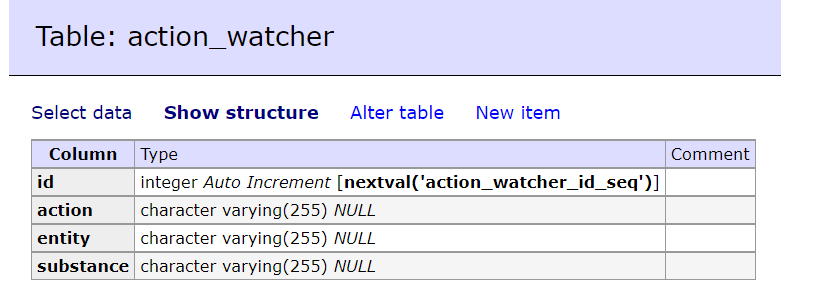
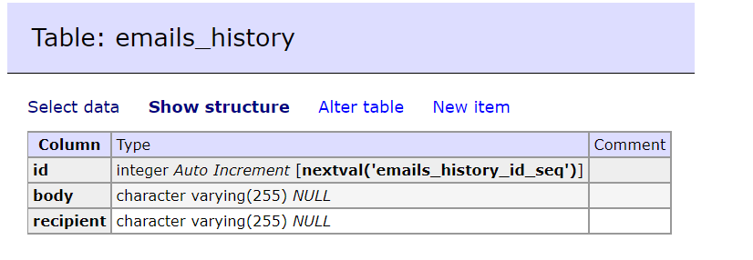

# Lab 2-4. App with Spring Framework architecture/technologies
# 6133 Gribanov Danil.
# Practical work #2
## Task 1
Use subject area from lab1.
## Task 2
Compare to lab1, from models were removed @NamedQueries, because Spring itself can implement simple queries.

Java beans developed as repository classes. Each entity class extends by CrudRepository interface from Spring.

## Task 3
Business layer represented as services which are uses CrudRepository classes for each model. 
To manage transactions and database access annotations @Transactional and @Repository were used.

Spring has vey strong and simple tools for business and data layers. 
Compare to JavaEE - development on Spring becomes very simple.

## Task 4
Controllers have minor changes, i.e. annotation from JavaEE were changed to Spring one.

## As a conclusion
Spring make development mush easier:
- Less boilerplate code;
- Fast development;
- Data layers much easier to implement;

# Practical work #3
## Tasks 1-3
The app is already with RESTApi

## Task 4-5
To return XML and not JSON, ACCEPT headers should be with value `application/xml`.

For some endpoint (`/disciplines`, `/teachers`) XSLT response is available.

# Practical work #4
## Task 1
Create new table:

## Task 2
In order to logg system operations - Spring AOP was applied.

This logic implement `LoggingAspect` class. This class watches for every service methods and logs all the events into 
JMS using `convertAndSend` method via topic with `event` destination.

## Task 3
In order to store loggs, service class needed for watched, but there are could be cycle-call in `LoggingAspect`. 
To escape that, `NoLoggin` class was created. `@NoLoggin` annotation must be applied to all methods of watcher service.

Thanks to AOP, we add logging system without any modification of the existing classes and logic.

## Task 4
As a receivers we will create two classes `JmsEmailReceiver` and `JmsEventReceiver` which will be listened to `event` 
destination and add each event into the watched/email table.

## Task 5
Create new table:

In this table, history of sent emails will be stored. Recipient - to whom email sent. Body - content of the email.

## Task 6
Using `LoggingAspect` could be added email-notification logic, when a user is trying to access nonexistent data.

Example:
Lets assume than only teacher with `id=1` exist in the system. 
If the user trying to get a teacher from `/teachers/44` (GET), 
the `LoggingAspect` detects this behavior and makes an email notification.
